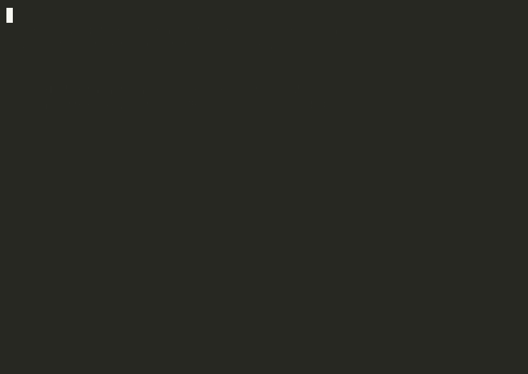

# ISNAD — Open-Source LLM Provenance & AI Audit Trail for RAG and Multi-Agent Systems

<p align="center"></p>

*Isnād–Rijāl Framework · grades the transmitters and the chain, not just the claim.*

**Open-source** `pip install isnad` — **LLM provenance**, **agent trust**, and an
**AI audit trail** for RAG and multi-agent systems. Apache-2.0, permanently.

**Every claim your pipeline produces carries a verifiable weakest-link trust grade
and a tamper-detecting audit trail**, so you can answer the question hallucination
detectors and observability tools skip: *who handled this claim, in what order,
and how much do we trust each one?*

> **The one-sentence pitch:** ISNAD gives you the **tamper-detecting audit records your
> regulators will demand** — a SHA-256 hash for every graded claim, mapped to the EU AI
> Act, ISO/IEC 42001, NIST AI RMF, and SDAIA. **You get the evidence an auditor verifies.** 📋


> **Proof it works:** ISNAD's weakest-link rule reproduces **a rule-based grading convention derived from Ibn Hajar's 12 narrator tiers at Cohen's κ = 0.87** across 575,060 graded hadith
> chains. (For context: scholars disagree with each other on *narrator grades*
> at κ = 0.33 — a different task.) Full benchmark below.

```python
# 30 seconds to a verdict:
from isnad import Registry, grade
from isnad.types import NarratorGrade

reg = Registry()
reg.register("openstax", "physics", grade=NarratorGrade.RELIABLE)
reg.register("pdf-scraper", "physics", grade=NarratorGrade.UNGRADED)
reg.register("ingest-model", "physics", grade=NarratorGrade.ACCEPTABLE)

verdict = grade("p = mv", ["openstax", "pdf-scraper", "ingest-model"], reg, domain="physics")
print(verdict.why)
# claim 'p = mv' → chain DAIF (weakest: pdf-scraper, ungraded)
```

> **Paper:** [arXiv:2607.24117](https://arxiv.org/abs/2607.24117) · **Software DOI:** [10.5281/zenodo.23201516](https://doi.org/10.5281/zenodo.23201516)

[](https://github.com/alizahidraja/isnad/actions/workflows/ci.yml)
[](https://www.python.org/)
[](LICENSE)
[](https://arxiv.org/abs/2607.24117)
[](https://pypi.org/project/isnad/)
[](https://www.npmjs.com/package/isnad)
[](https://glama.ai/mcp/servers/alizahidraja/isnad)

**🌐 Project home: <https://isnadhq.com/>** · **📚 Docs: <https://isnadhq.com/docs>** · ⭐ Star to follow along · [Contribute](CONTRIBUTING.md) · [Code of Conduct](CODE_OF_CONDUCT.md)

<p align="center"></p>

**JavaScript/TypeScript verifier:** `npm install isnad` verifies ISNAD audit records (SHA-256 / Merkle / detached signatures) from JS — *verifier only*, grading stays in the Python core. See [`js/README.md`](js/README.md).

---

## What & Why

In a RAG pipeline or multi-agent system, a factual claim passes through many
hands — a scraper extracts it, an agent compiles it, another model serves it.
Each hand can drop, distort, or invent. **Observability and data-lineage tools
record *what* happened; ISNAD grades *who* transformed the claim**, so you know
how much to trust the result — and can export the whole judgment as a
tamper-detecting audit record for governance review.

The framework adapts **hadith transmission science** — one of history's most
rigorous epistemologies, refined over fourteen centuries — into a Python library.
Every claim carries its complete chain of transmitters (isnād); each transmitter
is graded in a living registry (rijāl); chains are capped by their weakest link;
content is criticized independently of transmission; and the two combine in a
decision matrix that routes claims to serve, review, or quarantine.

## How ISNAD differs from a hallucination detector

Most tools ask about the **output** — *"is this answer grounded in the retrieved
context?"* (Cleanlab TLM, Galileo, Patronus, TruLens, RAGAS) or *"what happened
during this run?"* (LangSmith, Langfuse, Arize). ISNAD asks the question they
skip: **"who handled this claim, and how much do we trust each transmitter?"**

| Tool | What it grades | Records the chain (lineage)? | Grades the transmitters / chain (trust)? |
| --- | --- | --- | --- |
| 🧪 Cleanlab TLM | Trustworthiness of the LLM **response** | ❌ | ❌ |
| 🎯 Galileo / Patronus / TruLens / RAGAS | Output **faithfulness / groundedness** vs retrieved context | ❌ | ❌ |
| 🔍 LangSmith / Langfuse / Arize | **Traces** (what happened) + output evals | ✅ | ❌ |
| 🧬 OpenLineage / Marquez / DataHub | **Data lineage** (what touched what) | ✅ | ❌ |
| ✨ **ISNAD** | **The transmitters and the transmission chain** — weakest-link grading, corroboration with madār discounting, tamper-detecting audit | ✅ | ✅ |

**What ISNAD is NOT — and why that's the point.** Three honest answers, up front:

1. *"Tracers already record who handled it."* They record the order; they don't
   **grade** each transmitter, propagate a weakest-link verdict, or gate on it.
2. *"Your grades are operator-assigned, so it's GIGO."* The grades are **priors +
   audited observations + independent corroboration**, propagated by a documented
   method. ISNAD makes trust *explicit and auditable* — it doesn't auto-measure it,
   and it never pretends to.
3. *"Claim critics measure truth better than you."* Correct — and ISNAD **composes
   with them** (matn criticism). It doesn't replace them; it grades the chain that
   carried the claim.

**Free, Apache-2.0, self-hostable — permanently.** The core (`src/isnad/`) stays
Apache-2.0 forever; any future commercial surface lives in a separate repo under
its own licence (see [`LICENSING.md`](LICENSING.md)). The claim-graders above are
paid SaaS APIs; ISNAD is open-source and self-hostable.

## Quickstarts

### 30 seconds — grade a claim

```bash
pip install isnad
```

```python
from isnad import Registry, grade
from isnad.types import NarratorGrade

reg = Registry()
reg.register("openstax", "physics", grade=NarratorGrade.RELIABLE)
reg.register("pdf-scraper", "physics", grade=NarratorGrade.UNGRADED)
reg.register("ingest-model", "physics", grade=NarratorGrade.ACCEPTABLE)

verdict = grade("p = mv", ["openstax", "pdf-scraper", "ingest-model"], reg, domain="physics")
print(verdict.why)
# claim 'p = mv' → chain DAIF (weakest: pdf-scraper, ungraded)
```

### 60 seconds — full chain + content criticism + decision matrix

```bash
pip install isnad
```

```python
from isnad import Registry, Chain, ChainLinkSpec, grade_chain_from_registry, decide
from isnad.types import NarratorGrade, ContentVerdict
from isnad.critics import EmbeddingCritic

chain = Chain([
    ChainLinkSpec("openstax-textbook", 0, domain="physics"),
    ChainLinkSpec("pdf-scraper-v2", 1, domain="physics"),
    ChainLinkSpec("ingest-model-v3", 2, domain="physics"),
])

reg = Registry()
reg.register("openstax-textbook", "physics", grade=NarratorGrade.RELIABLE)
reg.register("pdf-scraper-v2", "physics", grade=NarratorGrade.RELIABLE)
reg.register("ingest-model-v3", "physics", grade=NarratorGrade.ACCEPTABLE)

chain_grade = grade_chain_from_registry(reg, chain)

critic = EmbeddingCritic()  # offline; obvious contradictions only — see Scope
verdict = critic.evaluate("p = h/λ", "p = h/lambda", ["p = mv"])
action = decide(chain_grade, verdict)

print(f"Chain: {chain_grade.value.upper()} | Content: {verdict.value} | Action: {action.value}")
```

### LangChain integration (5 lines)

```bash
pip install isnad[langchain]
```

```python
from isnad.integrations.langchain import IsnadCallbackHandler, seed_registry

reg = seed_registry({"source:docs": "reliable", "model:gpt-4o": "acceptable"})
handler = IsnadCallbackHandler(registry=reg, domain="physics")
chain.invoke("What is F=ma?", config={"callbacks": [handler]})
trace = handler.to_trace()  # isnad_trace v0.1 JSON
```

Also available: `IsnadTracer` and `AsyncIsnadCallbackHandler` for async pipelines.

**`IsnadMiddleware` (gating).** The callback *captures* traces; the middleware
*gates* claims. Note, honestly: the core `gate()` function is **importable and
testable today**, but the LangChain `AgentMiddleware` wiring is **forward-looking**
(it targets LangChain's 2026 `AgentMiddleware` API; see
`src/isnad/integrations/langchain/middleware.py`). The callback handler is the
production-ready capture path.

```python
from isnad.integrations.langchain import IsnadMiddleware
mw = IsnadMiddleware(reg, domain="physics")  # wrap_tool_call grades + gates
```

> **Want to ship this to a real system this afternoon?** See
> [`docs/onboard-in-a-day.md`](docs/onboard-in-a-day.md) for three copy-paste
> recipes (self-maintaining KB, medical RAG, legal RAG) and the honesty
> contract that must not be broken.

---

## Documentation

Read in order, or jump to what you need:

- 🚀 **[Quickstart](docs/quickstart.md)** — add ISNAD to your LangChain agent in 5 minutes.
- 💡 **[Concepts](docs/concepts.md)** — how isnād–rijāl maps to multi-agent provenance.
- 📋 **[Compliance](docs/compliance.md)** — EU AI Act · ISO/IEC 42001 · NIST AI RMF · SDAIA.
- 📊 **[Model-drift leaderboard](docs/model-drift-leaderboard.md)** — measured hallucination vs. chain depth.
- 🗺️ **[Architecture](docs/ARCHITECTURE.md)** — the four loops and the module map.


## What's Validated vs. What's Not

The honesty box is the point: what's proven, what's measured, and what's open.

| Component | Status | Notes |
| --- | --- | --- |
| **Weakest-link quarantine** | ✅ Validated | Every COMPROMISED-integrity narrator chain (proven liar/fabricator) grades MAWDU and is blocked; a SUSPECT (accused/abandoned) narrator grades ḍaʿīf jiddan — both quarantine (the SUSPECT→ḍaʿīf jiddan path is exercised in §8; the COMPROMISED→mawḍūʿ path is unit-tested) |
| **ISNAD-Bench (classical ground truth)** | ✅ Measured | κ = **0.871** (3-way headline) / **0.8667** (5-way, mapping v2) / **0.761** lenient vs 575,060 chains graded by a rule-based convention (Ibn Hajar's 12 narrator tiers); narrator-grade agreement κ = 0.331; shuffled control −0.0066 — `bench/docs/RESULTS.md` |
| **Corroboration (mutābaʿāt)** | ✅ Validated | 603/603 Wikipedia + 104/104 physics semantically-matched pairs; **8/8 Wikipedia + 9/9 physics negative controls** (#127); requires attested distinct lineage (#54) |
| **Chain-scoped grounding** | ⚠️ Partial | `ChainLinkSpec.retrieved_rows` + `chain_scoped_corpus` + `ChainScopedGroundingPolicy` flag a claim grounded only off its own chain (`grounded_off_chain_only`, a grounding gap — **evidence, not an action**). Wired into `POST /v1/claims` (#216); the flag requires a CONSISTENT-capable critic (NLI/LLM with the affirmation gate bypassed — the default EmbeddingCritic is contradiction-only, so the flag is inert unless you configure one); FP measurable via `experiments/grounding_eval` (#239; requires the `nli` extra — the committed result artifact is pending NLI-model availability, and the harness aborts rather than report FP=0 by construction). |
| **Content-madār fingerprint calibration** | ✅ Measured | `experiments/madar_eval` — the shared-error fingerprint is measured at **FP 0.375 on independent agreement** (down from 0.750 after tightening #232) with token-bearing recall 1.0. The **near-miss boundary class (a correct vs wrong value, e.g. 1687 vs 1689) is now correctly separated (0/4 false positives)** (#233). |
| **Seed-grade bootstrapping** | ✅ Validated | Evidence-backed `Registry.seed()`; coverage is critic-bound: the contradiction-only `EmbeddingCritic` now serves **0%** (it can no longer affirm CONSISTENT); the LLM critic is the coverage ceiling — `experiments/cold_start_coverage/RESULTS.md` |
| **Content criticism** | ⚠️ Partial | The binding constraint. LLM critic: 1.000 recall / **0.000 false-consistent on the 60-case eval set**, but **39.1% false-consistent on §8 content corruption** (#126) — see `docs/critics.md`. Offline critics are safe but conservative (recall 0.12–0.76); the zero-dependency TF-IDF critic is now contradiction-only (never affirms consistency, so 0.000 false-consistent by construction). |
| **jarḥ–taʿdīl discovery** | ⚠️ Partial | Finds injected weak narrators; good narrators need seed grades |
| **Bayesian grading** | ✅ Default | Beta posterior per (narrator, role, domain); `ISNAD_POLICY` env override |
| **Confidence-gating** | ❌ Useless | Model self-confidence is uncorrelated with defects — stated, not hidden |
| **Tamper-detecting audit** | ✅ Implemented | Self-hash + detached signatures + Merkle log; tail-truncation and forger limits disclosed |
| **Period-sliced grades** | ✅ Implemented | `get_grade_as_of()` — the ikhtilāṭ (decline) remedy, #43 |
| **Integrity ladder + recoverability** | ✅ Implemented | Integrity strikes are permanent; precision-driven REJECTED is recoverable (#30, #40) |

**Honest limits (stated up front):** grades are **ordinal-only** (ṣaḥīḥ > ḥasan > ḍaʿīf > ḍaʿīf jiddan > mawḍūʿ,
never a numeric confidence); cold-start is worse per-role; integrity is
domain-scoped, not global; chain independence cannot be *proven* from topology
(only assumed from attested lineage, then discounted — #54); the content critic is
the coverage ceiling; corroboration rarely fires on dense technical corpora where
genuine cross-source overlap is rare. These are features, not bugs — ISNAD says
exactly what works, what's limited, and where you supply your own components.
The serving index is in-memory (single-node deployment; multi-worker HA is not
yet supported — #199).

## ISNAD-Bench — measured against a rule-based grading convention

The strongest evidence is a number, not a claim: ISNAD's weakest-link rule, run
on **575,060 graded hadith chains** (a rule-based convention derived from Ibn Hajar's 12 narrator tiers), measured
for agreement:

| Quantity | Cohen's κ |
| --- | ---: |
| **ISNAD vs the dataset's rule-based chain-verdict code** (strict default, 3-way) | **0.8714** |
| — 5-way (mapping v2) | 0.8667 |
| — 4-way (v1, pre-review) | 0.8745 |
| a single critic vs Ibn Hajar's tier | 0.450 |
| critic vs critic (narrator-grade agreement, context) | 0.331 |

**Not the same scale.** The headline 0.8714 is *chain-verdict* agreement (3-way — ṣaḥīḥ / ḥasan / weak); the 5-way (0.8667, mapping v2, post-hoc after the expert review) is a sensitivity; v1's 4-way (0.8745) conflated "fabricated" with "very weak" before the split. ISNAD's mawḍūʿ class is now keyed on COMPROMISED integrity (proven liar/fabricator), and the 3-way κ is the robust headline;
the 0.450 and 0.331 figures measure *narrator-grade* agreement (5 classes) — a
different task. The 0.331 is context for how contested the underlying narrator
grades are, not a direct ceiling on the chain κ.
**How to read it:** κ = 0.87 is **conformance**, not agreement with independent
scholar judgment. The dataset's chain verdicts are a rule-based convention derived
from Ibn Hajar's 12 tiers (per-tier purity 0.88–0.97; the keyword classifier agrees
with the source's structured code at 99.92%, ruling out classifier error), and ISNAD's weakest-link mapping conforms to that convention. The
0.331/0.450 figures are narrator-grade agreement — context on how contested the
tiers are, not a ceiling. The benchmark is
pre-committed, carries negative controls (majority-class 0.000; shuffled grades
−0.0066), and buckets every disagreement. Full write-up: [`bench/docs/RESULTS.md`](bench/docs/RESULTS.md).

```bash
uv run python -m bench.run               # strict (default), full corpus
uv run python -m bench.run --lenient     # ungraded → ḥasan
uv run python -m bench.human_ceiling     # the narrator-grade agreement
uv run python -m bench.ikhtilat          # the mukhtaliṭūn (period-sliced grades)
```

The dataset (`emadjumaah/hadith-kg`, CC-BY-4.0, 1.6 GB) is gitignored and pinned by
SHA-256 — see [`bench/README.md`](bench/README.md). The derived graded output (per-chain
convention verdict + ISNAD prediction + disagreement bucket) is published as the
[`alizahidraja/isnad-bench` dataset on Hugging Face](https://huggingface.co/datasets/alizahidraja/isnad-bench).

## Transfers to AI provenance — measured on RAGTruth

The κ = 0.871 above is the methodology's home turf (hadith chains). The transfer to live LLM
pipelines is measured separately and published honestly. On **RAGTruth**, the **grounding critic ISNAD
composes with** (its matn layer) transfers at **Cohen's κ = 0.4345** over all 1,800 RAGTruth
responses (57 unparseable, 3.2%, scored fail-closed) — 96.0% hallucination recall at 60.4% precision
(plus a 49.9% false-positive rate on grounded responses), vs a 55.8% majority-class baseline. That
number belongs to the composed critic, **not** to ISNAD's
chain grading (WHO). The weak bi-encoder
signal (κ ≈ 0.1) is reported alongside, not hidden. Case study + limits: [`G1_CASE_STUDY.md`](G1_CASE_STUDY.md).

**Home:** [isnadhq.com](https://isnadhq.com)

## Glossary — the Arabic, in plain English

The name and lineage are the reason to trust the design; you don't need the Arabic
to use it. Every term is defined on first use.

| Term | Meaning |
| --- | --- |
| **isnād** | The transmission chain — who handled a claim, in order |
| **rijāl** | The registry of transmitters ("narrators") and their grades |
| **jarḥ–taʿdīl** | The criticism-and-accreditation loop that moves grades with evidence |
| **ʿadālah** | Integrity — can this transmitter be trusted not to lie? |
| **ḍabṭ** | Precision — how often is this transmitter *accurate*? |
| **ittiṣāl** | Chain continuity (no gaps); a gap = munqaṭiʿ → capped weak |
| **mutābaʿāt** | Corroboration — independent chains agreeing upgrade a claim |
| **madār** | The hidden pivot — "independent" chains that secretly share an upstream |
| **matn** | The claim content, criticized separately from the chain |
| **ṣaḥīḥ / ḥasan / ḍaʿīf / ḍaʿīf jiddan / mawḍūʿ** | Sound / good / weak / very weak / fabricated — the five chain grades. "mawḍūʿ" (fabricated) is keyed on COMPROMISED integrity (proven liar/fabricator, rank 12); "ḍaʿīf jiddan" (very weak) on SUSPECT (accused/abandoned, ranks 10–11). Both quarantine — mawḍūʿ permanently, ḍaʿīf jiddan recoverably. |
| **ʿilal** | Hidden defects in the chain or matn that survive surface grading — ISNAD does not implement ʿilal detection; it routes such cases to human review |
| **contradiction (taʿāruḍ)** | A sound chain whose content contradicts the corpus — routed to human review (ISNAD does not auto-adjudicate which source outranks the other) |

## The Decision Matrix

Chain grade × content verdict → action:

| | Content CONSISTENT | Content CONTRADICTION | Content UNVERIFIABLE |
| --- | --- | --- | --- |
| **Ṣaḥīḥ** (sound) | ✅ **SERVE** — cache | 🔍 **REVIEW** — contradiction (taʿāruḍ, highest-value case) | ⚠️ **SERVE WITH CAVEAT** |
| **Ḥasan** (good) | ⚠️ **SERVE WITH CAVEAT** | 🔍 **REVIEW** — hold, do not serve | 🔍 **REVIEW** |
| **Ḍaʿīf** (weak) | 🔍 **REVIEW** — seek corroboration | 🚫 **QUARANTINE** | 🔍 **REVIEW** |
| **Ḍaʿīf jiddan** (very weak) | 🚫 **QUARANTINE** | 🚫 **QUARANTINE** | 🚫 **QUARANTINE** |
| **Mawḍūʿ** (fabricated) | ⛔ **REJECT + QUARANTINE NARRATOR** | ⛔ **REJECT + QUARANTINE NARRATOR** | ⛔ **REJECT + QUARANTINE NARRATOR** |

Two defaults to notice: contradictions go to a human by default (LLMs are bad at
reconciling competing evidence), and **ṣaḥīḥ × contradiction is the highest-value
signal**, not an error state.

Two serve-side gates apply on top of the matrix (both demote, never promote):

- **Prior-only gate** — a narrator graded from a population *prior* alone
  (seeded, zero observed instances) can `SERVE WITH CAVEAT` at most; plain
  `SERVE` requires observation- or human-backed narrators. High-stakes
  domains opt into a hard gate (`ISNAD_SERVE_GATE=hold` or
  `ISNAD_SERVE_HOLD_DOMAINS=medical,legal`) → `REVIEW`.
- **Hold-mode UNVERIFIABLE** — in a hold domain, a sound chain with
  unverifiable content is held (`REVIEW`), never caveat-served.

## Pluggable Strategies — Extend It

The framework leaves key parameters open by design (paper §4.2/§4.3). Swap any:

| Strategy | Default | What to provide |
| --- | --- | --- |
| `GradingStrategy` | `RefinedWeakestLink` | How links combine into a chain grade |
| `TransitionPolicy` | `BayesianTransitionPolicy` | Evidence → narrator grade transitions |
| `CorroborationPolicy` | `CappedCorroborationPolicy` | Independent chains → claim upgrade |
| `CorrelationDetector` | `SharedLineageDetector` | True independence between chains |
| `ContentCritic` | `HybridCritic` / `EmbeddingCritic` | Content contradiction detection |

**Swap a critic in one line:**

```python
from isnad.critics import best_available_critic, EmbeddingCritic, LLMCritic

critic = best_available_critic()                 # LLM if configured, else NLI, else TF-IDF
critic = best_available_critic(prefer_llm=False) # force an offline critic
critic = LLMCritic(provider="ollama", model="llama3.1")  # local — no API key, no cloud
critic = LLMCritic(provider="openrouter", model="openai/gpt-4o-mini")  # any LLM
```

Critic tiers are documented with their **measured** recall in [`docs/critics.md`](docs/critics.md).
The LLM critic is provider-agnostic (OpenRouter, OpenAI, DeepSeek, Anthropic,
Gemini, Groq, Together, Ollama, or any OpenAI-compatible endpoint). For best
results use the LLM critic — but see the honesty note above: it is not an
acceptance gate on content corruption (#126).

**Cold-start bootstrapping (#33).** A new pipeline starts with every narrator
UNGRADED, so nothing serves. Seed grades are the fix — evidence-backed priors
(`Registry.seed` records `BOOTSTRAP_SEED` evidence):

```python
from isnad import Registry, NarratorGrade, seed_from_benchmark

reg = Registry()
reg.seed("source:openstax", "physics", NarratorGrade.RELIABLE, source="publisher")
seed_from_benchmark(reg, "model:gpt-4o@v1", "physics", 0.93, benchmark="mmlu")  # accuracy → grade
```

## Audit & Compliance Evidence

ISNAD can **export a tamper-detecting audit record** for any graded claim:

```bash
isnad export --claim <id> --format json    # or jsonl|csv; --verify; --sign; --redact; --chain-log
```

Each record captures the full chain (as an explicit **DAG** via `upstream_ids`),
the weakest link, source-document hashes, human-oversight evidence, the
environment, and a SHA-256 integrity hash over the RFC 8785-canonical form of its
payload — plus an optional detached signature (HMAC/Ed25519), a tamper-detecting
hash chain, and a PII-redaction hook.

**Serving-side signing:** the API signs records with a detached HMAC only when
`ISNAD_HMAC_SECRET` is set; when unset, records are emitted `audit_signed: false`
(a self-hash a forger can recompute). Set it in any deployment that relies on
tamper-evidence — see `.env.example`.

**Two tamper-evidence logs:** a **linear hash chain** (single sequential writer)
and a **Merkle batch log** (mass parallel agents; `build_batch`/`seal_batches`/
`verify_batches`/`prove_inclusion`). Both detect modification, middle-deletion,
and reordering; neither detects tail truncation, and both commit to a self-hash,
so they detect post-hoc modification — not a forger who rebuilds the chain (#97).

```python
from isnad.audit import build_audit_record
from isnad.audit.canonical import canonical_hash

record = build_audit_record(claim_id, session, registry)  # -> AuditRecord
assert record.integrity.record_hash == canonical_hash(record.to_dict(include_integrity=False))
```

**ISNAD produces evidence artifacts; it does not confer conformity with any
regulation.** See [`docs/evidence-mapping.md`](docs/evidence-mapping.md) for an
*informational* mapping of each field to the EU AI Act, ISO/IEC 42001, the NIST AI
RMF, and SDAIA — and the explicit statement of what ISNAD deliberately does *not*
provide. **The core library is Apache-2.0, permanently** ([`LICENSING.md`](LICENSING.md)).

## Scope and limitations

ISNAD grades **post-entry provenance** — who handled a claim after it entered your
pipeline, and how much you trust them — **not** whether the upstream source or the
final answer is objectively true.

**What ISNAD covers:** ordered chains + narrator grades; weakest-link grading +
the decision matrix; content criticism *against your corpus*; corroboration when
independent chains agree.

**What ISNAD does not cover:**

- **Source legitimacy at the boundary** — grades are operator-assigned assertions,
  not auto-verified facts.
- **Novel claim truth** — new, unverifiable claims are not auto-fact-checked.
- **Faithful transmission of bad input** — a `RELIABLE` fake publisher + a clean
  pipeline can still yield a high chain grade.

**Boundary vetting is the operator's responsibility** — vet sources before
registering them as `RELIABLE`; register unknowns as `UNGRADED`; use matn,
corroboration, and human review as *downstream* gates, not a replacement for it.

## Integrations

- **LangChain / LangGraph** — callback handler + tracer + middleware (above).
- **CrewAI / LlamaIndex** — adapters (`isnad.integrations.crewai`, `.llamaindex`).
- **OpenTelemetry** — `isnad ingest --otlp` grades an existing GenAI trace (#73).
- **MCP** — grade MCP servers as narrators: `MCPToolObserver` records tool calls
  as TOOL narrator links and grades the resulting chain; a `grade_claim` tool
  exposes the operator's registry to an agent (`isnad.integrations.mcp`, #59).
  `isnad mcp` runs a real FastMCP server over stdio (`pip install isnad[mcp]`).
  Honest limit: tool narrators stay **UNGRADED** by default (no auto-grading from
  call volume — that would be GIGO); the server returns operator-assigned grades,
  never manufactured ones.
- **Live Verify** — consume a `verify:` cryptographic seal as a high-trust narrator,
  anchoring ʿadālah on day one (solves cold-start; see `examples/issuer_demo/`).
  Honest limit: Live Verify proves *authenticity*, not *truth*.

A **chain viewer** (`viewer/index.html`) renders transmission chains in the browser
— three fixtures including the most important one: *false corroboration* (five
transmitters across three chains, all tracing to one source) rendered as a warning,
not consensus.

## Experiments

Every headline number is reproducible from the repo (mostly no API keys):

- **Adversarial benchmark** — narrator grading 100% caught / 0 false positives;
  content criticism is the binding constraint (`experiments/adversarial_benchmark/`).
- **§8 gated-vs-ungated** — 17,021-claim four-book corpus (11,918 eval/seed × 10 seeds); weakest-link quarantine validated; the chain grade ranks WHO-driven corruption (DISCRIMINATION.md: ḥasan 4.6% → ḍaʿīf 15.1%; chain-only serving 4.2% vs 9.2% random) (`experiments/s8_gated_vs_ungated/`).
- **Semantic corroboration** — 707 claim pairs, 8/8 + 9/9 negative controls
  (`experiments/corroboration_v2/`, `corroboration_v3/`).
- **A/B demonstration** — 2 caught, 2 missed (honestly), 0 false positives
  (`experiments/verified_vs_unverified/`).

## Open problems

- **Chain independence** (#54) — the detectable half is engine-wired (attested
  lineage, document-hash madār, tawātur discount, witness-type priors, content-level
  madār); the undetectable half (correlated training data across model families)
  remains an open, stated limit.
- **Content critic is the coverage ceiling** (#34) — a semantic critic that returns
  CONSISTENT on real prose is the highest-value component. The numeric-aggregate
  slice is now deterministic (`RecomputeCritic`/`EnsembleCritic`/`AggregateRouter`);
  general semantic criticism is still LLM/NLI-tier.

## Contributing

Built in public — collaborators welcome. The on-ramp:
[`CONTRIBUTING.md`](CONTRIBUTING.md) (branch flow, quality gates, code map) ·
[`CODE_OF_CONDUCT.md`](CODE_OF_CONDUCT.md) ·
[`SECURITY.md`](SECURITY.md) (honesty is a security property) ·
[`THREAT_MODEL.md`](THREAT_MODEL.md) ·
[good first issues](https://github.com/alizahidraja/isnad/issues?q=label%3A%22good+first+issue%22).

## Ecosystem

- 🌐 **Site:** <https://isnadhq.com/> · 📄 **Paper:** [arXiv:2607.24117](https://arxiv.org/abs/2607.24117) · 🤗 **HF Papers:** [2607.24117](https://huggingface.co/papers/2607.24117) · 💾 **Software DOI:** [10.5281/zenodo.23201516](https://doi.org/10.5281/zenodo.23201516) · 📦 **PyPI:** [`isnad`](https://pypi.org/project/isnad/)
- 🚀 **Docs — start here:** [`Quickstart`](docs/quickstart.md) (5-minute LangChain) · [`Concepts`](docs/concepts.md) (isnād–rijāl → multi-agent) · [`Compliance`](docs/compliance.md) (EU AI Act · ISO 42001 · NIST RMF · SDAIA) · [`Model-drift leaderboard`](docs/model-drift-leaderboard.md)
- 🗺️ **Architecture:** [`docs/ARCHITECTURE.drawio`](docs/ARCHITECTURE.drawio) · 🔗 **Trace schema:** [`docs/trace-schema.md`](docs/trace-schema.md) · 👁️ **Chain viewer:** [`viewer/index.html`](viewer/index.html)
- 🧪 **Benchmark:** [`bench/docs/RESULTS.md`](bench/docs/RESULTS.md) · 🤗 **ISNAD-Bench dataset:** [`alizahidraja/isnad-bench`](https://huggingface.co/datasets/alizahidraja/isnad-bench) · 📊 **Critic eval:** [`docs/critics.md`](docs/critics.md) · 🕵️ **xz sleeper-narrator case study:** [`docs/case-study-xz-sleeper-narrator.md`](docs/case-study-xz-sleeper-narrator.md)

## Citation

```bibtex
@article{raja2026grading,
  author  = {Ali Zahid Raja},
  title   = {Grading the Narrators: An Isnād–Rijāl Framework for
             Claim-Level Provenance in Multi-Agent Knowledge Systems},
  year    = 2026,
  doi     = {10.48550/arXiv.2607.24117},
  eprint  = {2607.24117},
  archivePrefix = {arXiv},
}
```

## About

Built by [Ali Zahid Raja](https://alizahidraja.com) · ORCID [0009-0003-7875-4590](https://orcid.org/0009-0003-7875-4590).
The rigor belongs to fourteen centuries of muḥaddithūn; the transfer to AI systems
is the contribution claimed here.

**License:** Code — Apache 2.0 · Paper & docs — CC BY 4.0
